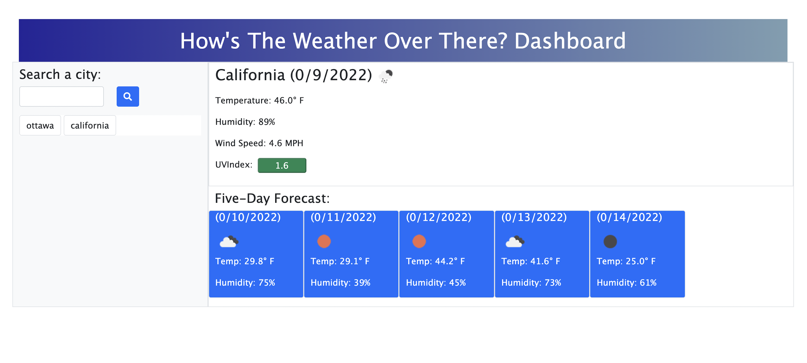

# hows-the-weather-over-there-ohya

Link to deployment: https://sabrtraveler.github.io/hows-the-weather-over-there-ohya/ 

This challenge of the bootcamp was to create a weather dashboard that will run in the browser and feature dynamically updated HTML and CSS using third party API.  
The weather dashboard has the following functionality: 

<li>There is a search bar on the dashboard where a user can input a city which will show current weather info. 
<li>Weather information like temperature, humidity, windspeed, uvIndex is fetched from the openweathermap API. 
<li>The uvindex changes from green, yellow, or red based on how favorable the weather condition is. 
<li>There is a five day forceast for the selected city which shows all pertinent weather data. 
<li>Under the search bar there is search history of cities that is retrieved from local storage.  
The following images shows the web application's appearance and functionality:   
  
